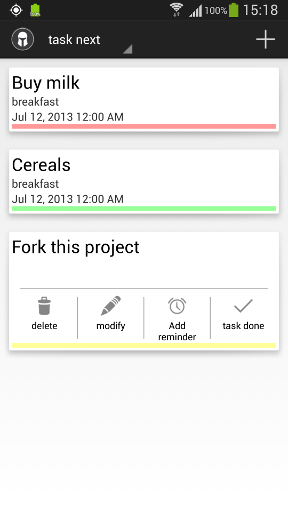
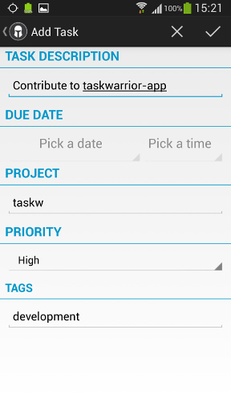

Taskwarrior for Android
=======================

Taskwarrior for Android will be a compatible App for the commandline tool Taskwarrior.

**See http://taskwarrior.org for more information about the CLI-Tool taskwarrior.**

Developed By
============

* Sujeevan Vijayakumaran - <mail@svij.org>

Screenshots
============
**Main screen**



**Add task**



License
=======

Copyright (c) 2012 Sujeevan Vijayakumaran

Permission is hereby granted, free of charge, to any person obtaining a copy of
this software and associated documentation files (the "Software"), to deal in
the Software without restriction, including without limitation the rights to
use, copy, modify, merge, publish, distribute, sublicense, and/or sell copies of
the Software, and to permit persons to whom the Software is furnished to do so,
subject to the following conditions:

The above copyright notice and this permission notice shall be included in all
copies or substantial portions of the Software.

THE SOFTWARE IS PROVIDED "AS IS", WITHOUT WARRANTY OF ANY KIND, EXPRESS OR
IMPLIED, INCLUDING BUT NOT LIMITED TO THE WARRANTIES OF MERCHANTABILITY, FITNESS
FOR A PARTICULAR PURPOSE AND NONINFRINGEMENT. IN NO EVENT SHALL THE AUTHORS OR
COPYRIGHT HOLDERS BE LIABLE FOR ANY CLAIM, DAMAGES OR OTHER LIABILITY, WHETHER
IN AN ACTION OF CONTRACT, TORT OR OTHERWISE, ARISING FROM, OUT OF OR IN
CONNECTION WITH THE SOFTWARE OR THE USE OR OTHER DEALINGS IN THE SOFTWARE.


Libraries
=========

Taskwarrior for Android is using following Libraries, which are licensed under
Apache License 2.0:

 * ActionBarSherlock – by Jake Wharton
 
See LICENSE in the subdirectories com_actionbar.


Development
=========

### Requirements

 * Installed [Android SDK](http://developer.android.com/sdk/) with tools

### Set up

#### CLI way

Fork this project at Github and add this repository as upstream.

```bash
$ git clone https://github.com/<your_githubuser>/taskwarrior-androidapp.git
$ cd taskwarrior-androidapp
$ git remote add upstream https://github.com/svijee/taskwarrior-androidapp
$ git fetch remote
$ git checkout -b remotes/upstream/master
$ git checkout -b my_feature_branch
```

Start the android GUI and download API 15 as our target.

```bash
$ android
```

Generate ant build files and more, API 15 is assumed to be target 1 (list with $(android list targets)). Make sure to not commit these generate files.

```bash
$ android update project --path taskwarrior-androidapp/ --target 1
$ android update project --path android-menudrawer/ --target 1
```

Create a virtual device (if you don't want to develop directly for you phone).

```bash
$ android create avd -n taskwarrior_emu -t 1
$ emulator -avd taskwarrior_emu &
```

Make your awesome changes and compile, install, and watch log outputs.
```bash
$ ant debug
$ ant installd # or $ adb -d install -r bin/TasksActivity-debug.apk
$ adb lolcat
```

When everything works make sure that your branch looks good, no generate files are committed and then make a pull request back here.


#### Eclipse way

To be written...
